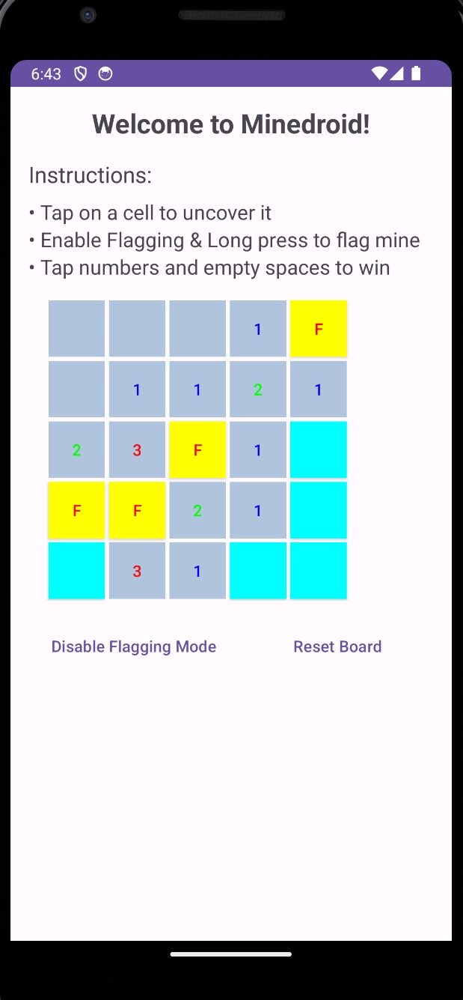
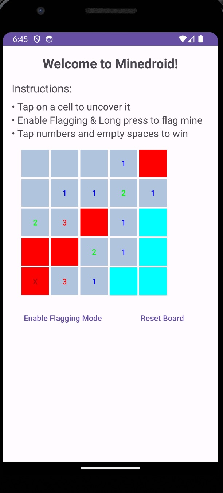

# MineDroid

**MineDroid** is a classic Minesweeper game for Android devices, developed using Kotlin. Test your logical thinking and strategic skills in this timeless puzzle game.

This Minesweeper Android application is a class project from Mobile Software Development (taught by Péter Ekler at AIT Budapest). It is an implementation of the classic game optimized for mobile phones.

## Features

- **Intuitive Gameplay:** Easy-to-use touch interface for seamless gameplay.
- **Difficulty Level:** Beginner modes to suit players of beginner levels.

## How to Play

1. **Tap:** Uncover a cell.
2. **Long Press:** Mark a cell as a potential mine.
3. **Use Numbers:** Use the numbers to deduce the location of mines.
4. **Winning:** Clear the entire grid without hitting a mine to win the game.

## Installation

1. Clone the repository: `git clone https://github.com/deepitc/MineDroid.git`
2. Open the project in Android Studio.
3. Build and run the project on your Android device or emulator.

## Screenshots

## Contributing

Contributions are welcome! Please fork the repository and create a pull request with your changes.

---

